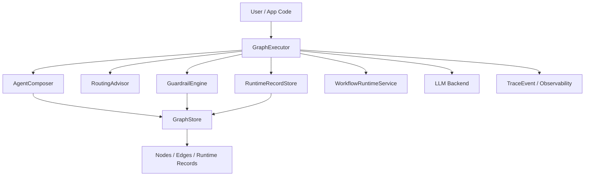

# Architecture

This document explains how the project is layered.

The intended product shape is:

- a control plane for agent systems that change over time
- a runtime for executing those systems
- an explainability layer for understanding composition and behavior

## Layers

### 1. Beginner API

Files:

- `yggdrasil/app.py`

Purpose:

- fast time-to-first-success
- code-generation-friendly helpers
- simple builder flow for first projects

### 2. Core Runtime

Files:

- `yggdrasil/core/nodes.py`
- `yggdrasil/core/edges.py`
- `yggdrasil/core/store.py`
- `yggdrasil/core/executor.py`
- `yggdrasil/core/guardrails.py`
- `yggdrasil/core/routing.py`
- `yggdrasil/core/runtime_records.py`
- `yggdrasil/core/workflow_runtime.py`

Purpose:

- graph data model
- traversal and execution
- tool execution
- routing and orchestration
- composition-time explainability
- run-time explainability signals

Internal split:

- `executor.py`: primary runtime entry point and traversal flow
- `routing.py`: `RoutingAdvisor` and routing validation / decision-table helpers
- `guardrails.py`: `GuardrailEngine` and permissions / secrets / schema helpers
- `runtime_records.py`: `RuntimeRecordStore` for persisted runtime-service records
- `workflow_runtime.py`: `WorkflowRuntimeService` for pause/resume and transaction helpers

## Runtime Collaboration



Intent:

- `GraphExecutor` coordinates execution
- `AgentComposer` resolves runtime composition from graph data
- `RoutingAdvisor` owns routing reasoning and validation
- `GuardrailEngine` owns permissions, secrets, and validation checks
- `RuntimeRecordStore` owns persisted runtime-service artifacts
- `WorkflowRuntimeService` owns pause/resume and transaction-oriented workflow behavior

### 3. Model Backends

Files:

- `yggdrasil/backends/`

Purpose:

- adapt provider-specific chat APIs into the shared `LLMBackend` contract

### 4. Tool Layer

Files:

- `yggdrasil/tools/`

Purpose:

- importable built-in tools
- tool registry
- stable callable references for config-driven integrations

### 5. Platform / Operations Layer

Files:

- `yggdrasil/exporters/`
- `yggdrasil/viz/`

Purpose:

- trace export and visualization

## Design Intent

The preferred dependency direction is:

```text
beginner API
  -> core runtime
     -> backends / tools
     -> platform layers build beside the runtime, not inside every example
```

The most important architectural constraint is this:

- changes to the agent system should be representable as graph/data changes
- explanations of behavior should be recoverable from the runtime and graph state

## Contributor Guidance

- Put new user ergonomics in the beginner API or docs first.
- Put execution semantics in the core runtime.
- Put operational workflows in config/admin modules.
- Avoid making `GraphExecutor` the default home for every new feature unless it truly belongs to execution.
